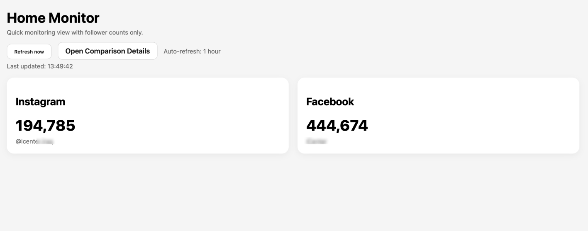

# Social Metrics Dashboard

A lightweight Node.js dashboard for monitoring weekly social performance across Instagram, Facebook, and respond.io.

It provides a fast home view for headline follower counts, a comparison view for week-over-week analytics, and an AI summary layer powered by either OpenAI or local Ollama.

## Screenshots

### Home Monitor



### Comparison Details


## Features

- Live follower monitoring for Instagram and Facebook
- Weekly comparison view for reach, impressions, interactions, CTR, and follower growth
- respond.io weekly contact tracking
- AI-generated week-over-week summary
- OpenAI support for hosted AI summaries
- Ollama support for local AI summaries without API billing
- Simple Express backend with static frontend pages

## Tech Stack

- Node.js
- Express
- `node-fetch`
- Meta Graph API
- respond.io API
- OpenAI Responses API
- Ollama local API

## Project Structure

```text
.
├── public/
│   ├── index.html
│   └── comparison.html
├── data/
│   └── respondio-stats.json
├── Screenshots/
├── server.js
├── package.json
└── README.md
```

## Views

### Home Monitor

The home page shows the current Instagram and Facebook follower counts in a minimal monitoring layout.

Route:

- `/`

### Comparison Details

The comparison page shows two selected weeks side by side and includes:

- Instagram KPIs
- Facebook KPIs
- respond.io weekly contacts
- week-over-week delta table
- comparison charts
- AI Insights summary

Route:

- `/comparison.html`

## Getting Started

### 1. Install dependencies

```bash
npm install
```

### 2. Configure environment variables

Create a `.env` file in the project root.

Required for Meta analytics:

```env
META_ACCESS_TOKEN=your_meta_or_user_access_token
IG_USER_ID=your_instagram_business_user_id
FB_PAGE_ID=your_facebook_page_id
```

Required for respond.io weekly contacts:

```env
RESPOND_ACCESS_TOKEN=your_respond_io_api_token
```

Optional Meta token override:

```env
USER_ACCESS_TOKEN=your_user_access_token
FB_ACCESS_TOKEN=your_facebook_page_access_token
```

Optional AI configuration:

```env
OPENAI_API_KEY=your_openai_api_key
OPENAI_MODEL=gpt-4.1-mini
OLLAMA_MODEL=qwen2.5:7b
```

Optional manual channel counts:

```env
LINKEDIN_FOLLOWERS=
TIKTOK_FOLLOWERS=
YOUTUBE_SUBSCRIBERS=
INSTAGRAM_CHANNEL_MEMBERS=
TELEGRAM_SUBSCRIBERS=
WHATSAPP_CHANNEL_FOLLOWERS=
```

Optional webhook secret:

```env
RESPONDIO_WEBHOOK_SECRET=your_secret
```

### 3. Start the server

```bash
npm start
```

Open:

- [http://localhost:3000](http://localhost:3000)

## AI Summary Providers

### Option 1: OpenAI

If `OPENAI_API_KEY` is set, the app uses OpenAI for the AI summary.

### Option 2: Ollama

If `OPENAI_API_KEY` is not set, the app falls back to Ollama.

Install and pull a local model:

```bash
ollama pull qwen2.5:7b
```

For a smaller local model:

```bash
ollama pull phi3:mini
```

Then optionally set:

```env
OLLAMA_MODEL=qwen2.5:7b
```

## API Endpoints

- `GET /api/meta/summary`
- `GET /api/respondio/summary`
- `GET /api/respondio/weekly-contacts`
- `POST /api/respondio/webhook`
- `GET /api/marketing/channels`
- `GET /api/ai/summary`
- `POST /api/ai/summary`

## Notes

- Weekly metrics are calculated on a Sunday-to-Saturday UTC range.
- Facebook insights may require a Page Access Token depending on permissions.
- The AI summary is intentionally constrained to reduce hallucinated explanations.
- Ollama is the recommended option for local testing when OpenAI billing is unavailable.

## License

This project is private unless you choose to add a license.
